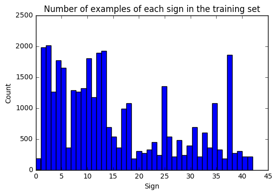
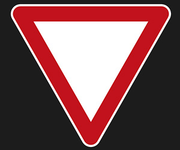
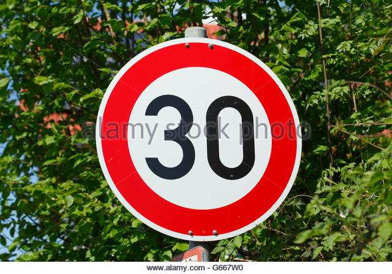
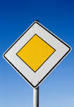

# **Traffic Sign Recognition**
---
In this project, use deep neural networks and convolutional neural networks to classify traffic signs. Specifically, train a model to classify traffic signs from the German Traffic Sign Dataset [1].

**Build a Traffic Sign Recognition Project**

The goals / steps of this project are the following:
* Load the data set (see below for links to the project data set)
* Explore, summarize and visualize the data set
* Design, train and test a model architecture
* Use the model to make predictions on new images
* Analyze the softmax probabilities of the new images
* Summarize the results with a written report

---
### Writeup / README

#### 1. Provide a Writeup / README that includes all the rubric points and how you addressed each one. You can submit your writeup as markdown or pdf. You can use this template as a guide for writing the report. The submission includes the project code.

You're reading it! and here is a link to my [project code](https://github.com/Everhusk/Self-Driving-Car-Engineering/blob/master/P2%20-%20Traffic%20Sign%20Classification/solution.ipynb)

### Data Set Summary & Exploration

#### 1. Provide a basic summary of the data set and identify where in your code the summary was done. In the code, the analysis should be done using python, numpy and/or pandas methods rather than hardcoding results manually.

The code for this step is contained in the second code cell of the IPython notebook.  

I used the pandas library to calculate summary statistics of the traffic
signs data set:

* The size of training set is? 34799
* The size of test set is? 12630
* The shape of a traffic sign image is? 32x32x3
* The number of unique classes/labels in the data set is? 43

#### 2. Include an exploratory visualization of the dataset and identify where the code is in your code file.

The code for this step is contained in the third code cell of the IPython notebook.  

Here is an exploratory visualization of the data set. It is a bar chart showing how the data ...

### Design and Test a Model Architecture

#### 1. Describe how, and identify where in your code, you preprocessed the image data. What tecniques were chosen and why did you choose these techniques? Consider including images showing the output of each preprocessing technique. Pre-processing refers to techniques such as converting to grayscale, normalization, etc.

The code for this step is contained in the section labeled Step 1 of the IPython notebook.

I decided not to convert the images to grayscale because although it takes longer to train, traffic sign colors is important information.

I normalized the image data because it can prevent overfitting.

#### 2. Describe how, and identify where in your code, you set up training, validation and testing data. How much data was in each set? Explain what techniques were used to split the data into these sets. (OPTIONAL: As described in the "Stand Out Suggestions" part of the rubric, if you generated additional data for training, describe why you decided to generate additional data, how you generated the data, identify where in your code, and provide example images of the additional data)

The code for splitting the data into training and validation sets is contained in the sixth code cell of the IPython notebook.  

To cross validate my model, I randomly split the training data into a training set and validation set. I did this by utilizing sklearn.

My final training set had 80% of images. My validation set and test set had the remaining 20% of images.

#### 3. Describe, and identify where in your code, what your final model architecture looks like including model type, layers, layer sizes, connectivity, etc.) Consider including a diagram and/or table describing the final model.

The code for my final model is located in the seventh cell of the ipython notebook.

My final model consisted of the following layers:

| Layer         		|     Description	        					|
|:---------------------:|:---------------------------------------------:|
| Input         		| 32x32x3 RGB image   							|
| Convolution 3x3     	| 1x1 stride, same padding, outputs 5x5x32 	|
| RELU					|												|
| Max pooling	      	| 2x2 stride,  outputs 5x5x16 				|
| Convolution 3x3	    | etc.      									|
| RELU					|												|
| Max pooling	      	| 2x2 stride,  outputs 5x5x16 				|
| Fully connected		| 512 output|
| RELU					|												|
| Fully connected		| 128 output |
| Softmax				|  |

#### 4. Describe how, and identify where in your code, you trained your model. The discussion can include the type of optimizer, the batch size, number of epochs and any hyperparameters such as learning rate.

The code for training the model is located in the ninth cell of the ipython notebook.

To train the model, I used a LeNet CNN with one-hot encoding.

#### 5. Describe the approach taken for finding a solution. Include in the discussion the results on the training, validation and test sets and where in the code these were calculated. Your approach may have been an iterative process, in which case, outline the steps you took to get to the final solution and why you chose those steps. Perhaps your solution involved an already well known implementation or architecture. In this case, discuss why you think the architecture is suitable for the current problem.

The code for calculating the accuracy of the model is located in the 14th cell of the Ipython notebook.

My final model results were:
* training set accuracy of ? 100%
* validation set accuracy of ? 97.6%
* test set accuracy of ? 100%

If an iterative approach was chosen:
* What was the first architecture that was tried and why was it chosen? After reading Traffic Sign Recognition with Multi-Scale Convolutional Networks. Pierre Sermanet and Yann LeCun, I decided to implement the same method (minus grayscaling) because it proved to be very accurate.
* What were some problems with the initial architecture? Figuring out how to implement it.
* How was the architecture adjusted and why was it adjusted? Typical adjustments could include choosing a different model architecture, adding or taking away layers (pooling, dropout, convolution, etc), using an activation function or changing the activation function. One common justification for adjusting an architecture would be due to over fitting or under fitting. A high accuracy on the training set but low accuracy on the validation set indicates over fitting; a low accuracy on both sets indicates under fitting.
* Which parameters were tuned? How were they adjusted and why? The parameters on the convultional layers were tuned. I.e. stride size, padding type, and output sizes.
* What are some of the important design choices and why were they chosen? For example, why might a convolution layer work well with this problem? How might a dropout layer help with creating a successful model?

If a well known architecture was chosen:
* What architecture was chosen? Yes, the LeNet architecture.
* Why did you believe it would be relevant to the traffic sign application? Because the paper had already proven the results.
* How does the final model's accuracy on the training, validation and test set provide evidence that the model is working well? Yes, it matched very well with the results of the paper.

### Test a Model on New Images

#### 1. Choose five German traffic signs found on the web and provide them in the report. For each image, discuss what quality or qualities might be difficult to classify.

Here are five German traffic signs that I found on the web:

The fourth image might be difficult to classify because it is a bit skewed from a full circle.

#### 2. Discuss the model's predictions on these new traffic signs and compare the results to predicting on the test set. Identify where in your code predictions were made. At a minimum, discuss what the predictions were, the accuracy on these new predictions, and compare the accuracy to the accuracy on the test set (OPTIONAL: Discuss the results in more detail as described in the "Stand Out Suggestions" part of the rubric).

The code for making predictions on my final model is located in the tenth cell of the Ipython notebook.

Here are the results of the prediction:

| Image			        |     Prediction	        					|
|:---------------------:|:---------------------------------------------:|
| Yield      		| Yield   									|
| Speed Limit (30km/h)     			| Speed Limit (30km/h) 										|
| Priority road					| Priority road											|
| No entry	      		| No entry					 				|
| Bumpy road			| Bumpy road      							|

The model was able to correctly guess 5 of the 5 traffic signs, which gives an accuracy of 100%. This compares favorably to the accuracy on the test set of ~98%.

#### 3. Describe how certain the model is when predicting on each of the five new images by looking at the softmax probabilities for each prediction and identify where in your code softmax probabilities were outputted. Provide the top 5 softmax probabilities for each image along with the sign type of each probability. (OPTIONAL: as described in the "Stand Out Suggestions" part of the rubric, visualizations can also be provided such as bar charts)

The code for making predictions on my final model is located in the last code cell of the Ipython notebook.

All five softmax probabilities were 100%.
