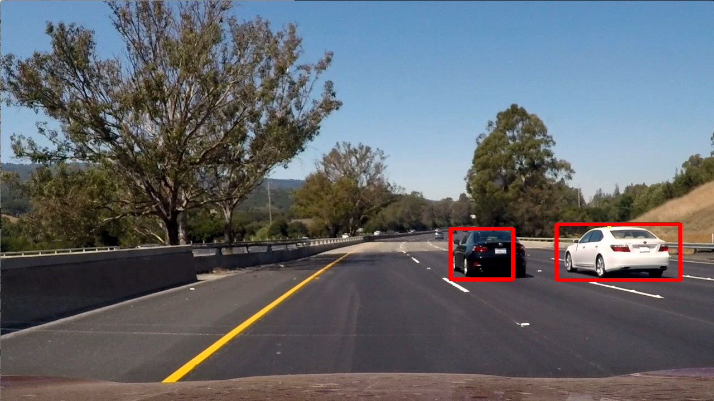
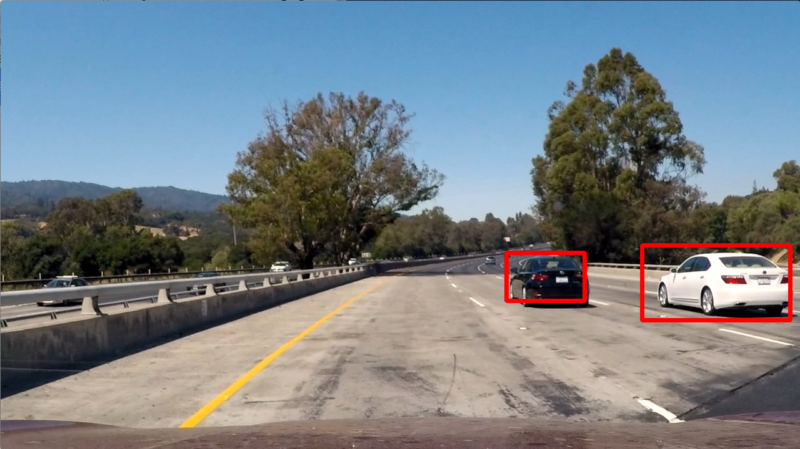
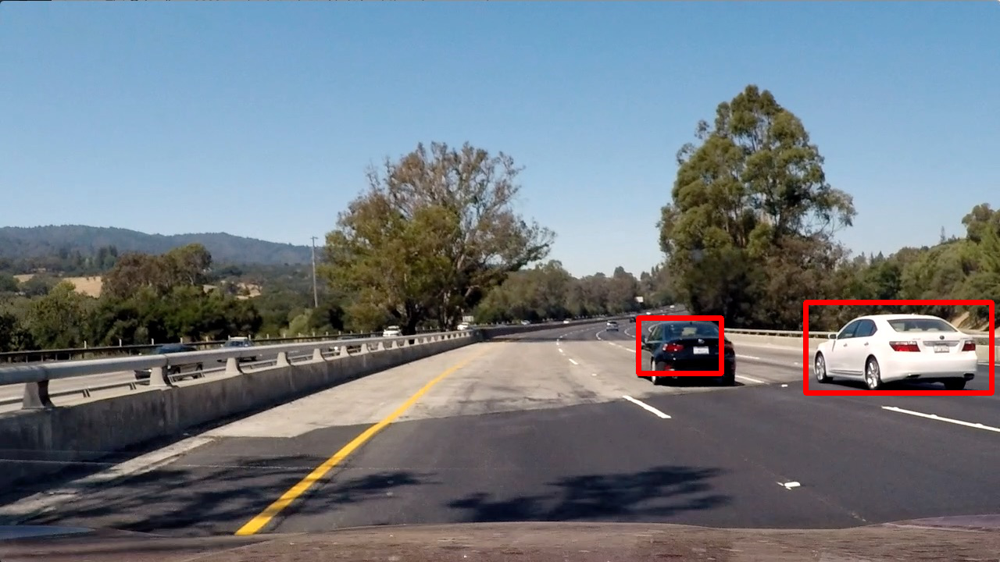

# **Vehicle Detection**

Write a software pipeline to detect vehicles in a video stream. Please refer to the [python notebook](https://github.com/Everhusk/Self-Driving-Car-Engineering/blob/master/P5/solution.ipynb) for details.
To solve this problem, a state-of-the-art, real-time object detection system called YOLO (You only look once) was implemented and applied to the test images/video.

## Results

Image 1

Image 2

Image 3

Image 4

Image 5

Image 6

Sample Video:

# Referenecs
[1] https://pjreddie.com/darknet/yolo/
